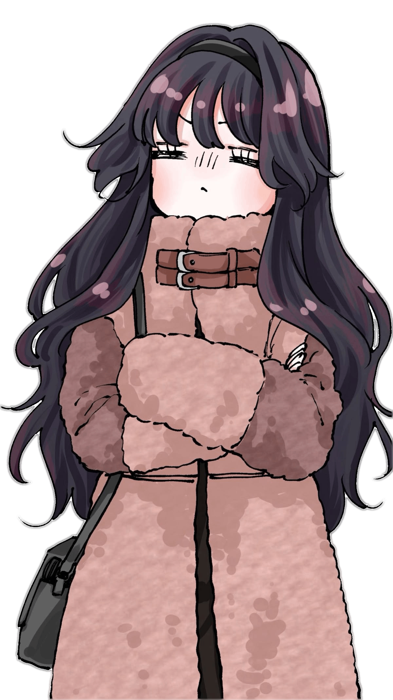

<h1 align="center">Yokoso! 👋 [happy]</h1>

  Welcome to <b>orenoi</b>’s cozy corner of code & anime!  
  <i>Kira-kira ✨ [yummy] &nbsp;|&nbsp; Doki-doki 💓 [funnyface] &nbsp;|&nbsp; Mochi-mochi 🤤 [drool] &nbsp;|&nbsp; Puyo-puyo 😊 [smile] &nbsp;|&nbsp; Waku-waku 💖 [lovely] &nbsp;|&nbsp; Washoi! 😳 [flushed]</i>  
  🎮 Casual anime lover who codes for fun — mostly Go & Python 🐍🐹 
  🐧 Arch Linux + Hyprland user (with occasional KDE vibes) 💜

---

### 👨‍💻 About Me

- 🔭 Not actively building projects, but I enjoy dabbling in **Go** & **Python** every now and then  
- 🐧 Arch Linux enthusiast rocking Hyprland most days  
- 🎨 Huge fan of terminal themes, clean setups, and all things anime  
- 📚 Learning at my own pace — mostly for fun!  
- 🍜 When not coding, you’ll find me binge-watching anime (slice of life & CGDCT fan)  

---

### 🛠️ Languages & Tools

 
 
 
 
 
 

---

### ⚡ Fun Fact

> “I code only when the mood hits me — otherwise, anime and lo-fi beats keep me company.” 🎧

---

  

